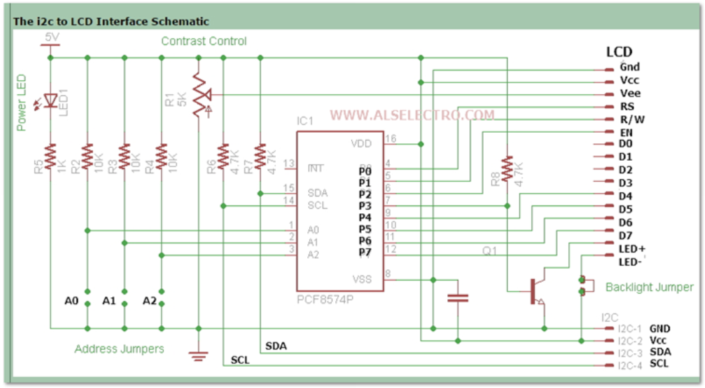
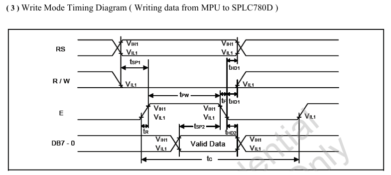
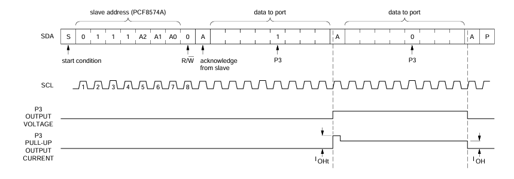
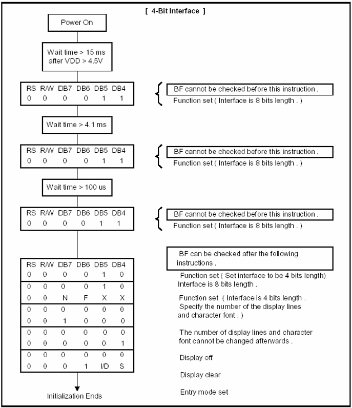
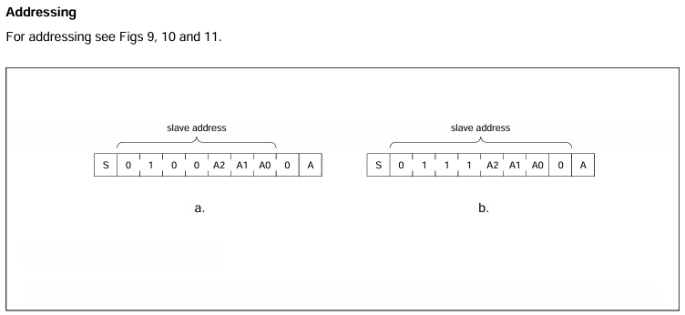

## LCD

#### LCD Schematic

- P0 = RS
- P1 = R/W
- P2 = EN
- P3 = Backlight
- P4 = D4
- P5 = D5
- P6 = D6
- P7 = D7

##### Wirte Mode Timing Diagram
DB7-0 should be written before Enable Off State 

Enable이 꺼지는 순간에 Data가 Valid Data가 되므로 두번 보내야 됨

##### Data bit Sequence
P7 ~ P0

##### Initialize Sequence

##### I2C Module Address
a를 보면 010 0A2A1A0이긴 한데 정확히 왜 0x27인지는 모르겠음

